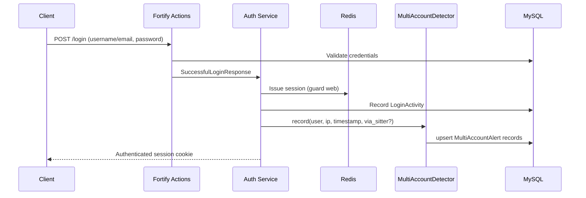
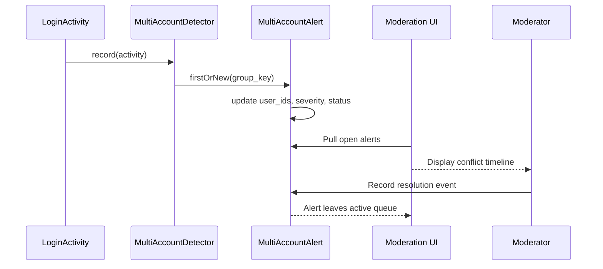

# TravianT Authentication Platform

Laravel 12 service that powers authentication, sitter delegation, and security alerting for TravianT. The application modernises the legacy PHP stack while maintaining compatibility with existing game services.

## Architecture

```mermaid
graph TD
    subgraph Clients
        Web[Web UI (Livewire)]
        Legacy[Legacy Travian client]
        APIs[3rd-party tools]
    end

    subgraph Laravel
        Fortify[Fortify Auth]
        Controllers[HTTP Controllers & Livewire]
        Services[Domain Services]
        Jobs[Queue Jobs]
    end

    subgraph Data
        MySQL[(MySQL)]
        Redis[(Redis)]
        Logs[(Audit Trail)]
    end

    Web --> Fortify
    Legacy --> Fortify
    APIs --> Controllers

    Fortify --> Controllers
    Controllers --> Services
    Services --> MySQL
    Services --> Redis
    Services --> Logs
    Jobs --> Redis
    Jobs --> MySQL

    Redis -. session, cache .- Fortify
    Logs -. login_activity .- Services
```

- **Fortify** handles credential authentication, password resets, and email verification.
- **Livewire** components render the secure dashboard, sitter tooling, and moderation views.
- **Redis** stores sessions, rate limits, and sitter invitation handshakes.
- **MySQL** persists canonical data: users, sitter delegations, login activities, and multi-account alerts.
- **Domain services** such as `MultiAccountDetector` and the `SitterDelegation` model enforce business rules shared with legacy infrastructure.

## Core Flows

### Authentication



- Passwordless sessions such as sitter delegation flag `via_sitter` and store the acting sitter ID.
- Failed attempts are throttled using Redis-backed Fortify rate limiting.
- Post-auth checks redirect to verification, maintenance, or ban Livewire screens depending on state.

### Sitter Delegation


- Owners cannot self-assign and must reference an existing user by username.
- Permissions are stored as JSON for compatibility with legacy sitter rules.
- Expired delegations are filtered with the `active()` scope on `SitterDelegation`.

### Alert Lifecycle



- Every successful login (direct or via sitter) records a `LoginActivity` entity.
- The detector aggregates activities into alert groups keyed by source type (IP or device) and hashes of `user_ids`.
- Moderation tooling records resolution notes; new conflicts on the same group key automatically reopen the alert (see ADR-0003).

## Documentation Index

- [ADR catalogue](docs/adr/README.md)
- [Sitter API reference](docs/sitter-api.md)
- [Alerting lifecycle](docs/alerting-lifecycle.md)
- [On-call runbooks](docs/runbooks/README.md)
- [Legacy migration plan](docs/project-analysis.md)

## Local Development

```bash
cp .env.example .env
composer install
npm install
php artisan key:generate
php artisan migrate --seed
npm run dev
php artisan serve
```

Run targeted tests with `php artisan test --filter=Sitter` and lint PHP with `vendor/bin/pint --dirty`.

---

Released under the MIT License.
