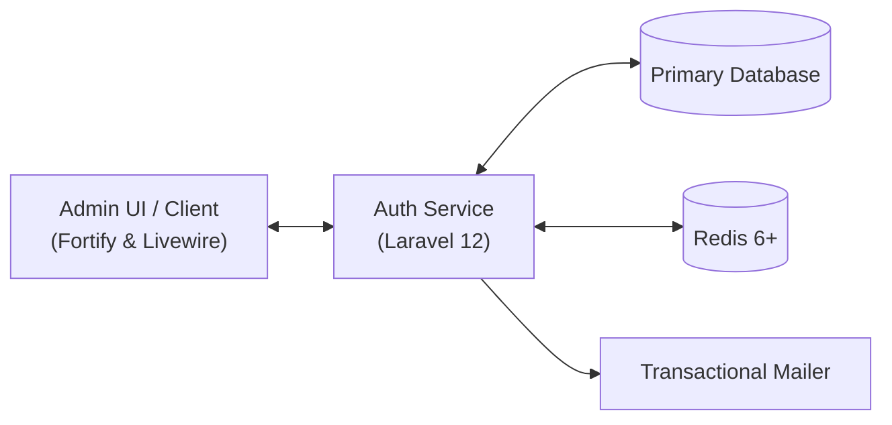

# Authentication Backend

This repository now contains the Laravel 12 service that powers the TravianT authentication stack after migrating it from the former `backend/` directory. The application ships with [Laravel Fortify](https://laravel.com/docs/fortify) and a set of integrations that replicate the legacy `Model\LoginModel` behaviour while modernising the platform.

## Scope & Non-Goals

- **In scope:** Account authentication, sitter delegation, role-aware guards for administrator and multihunter accounts, and the customer/order views that support the storefront migration workstream.
- **Out of scope (for now):** Gameplay mechanics, user profile customisation beyond Fortify defaults, payment integration, or Livewire implementations for alliance/game flows that still live in the legacy `_travian` tree. Those features remain tracked in the component plans under `/docs`.

## Architecture Overview



- The Laravel authentication service processes Fortify and Livewire requests, driving database writes and Redis-backed queues/sessions.
- Redis supports queues, cache, and session state for sitter context and multi-account detection.
- The mailer integration sends verification and recovery messages; administrators consume the same service through the Livewire admin UI.

## Key features

- **Fortify authentication** with username or email based login plus Redis-backed session storage.
- **Legacy sitter support** so delegated accounts can sign in with their own password while tracking the delegation context.
- **Role specific guards** for the special administrator (`legacy_uid = 0`) and multihunter (`legacy_uid = 2`) accounts.
- **Email verification** and password recovery flows with lightweight Blade views.
- **Multi-account detection** via IP logging, automatic alerts, and Redis sessions for continuity with the existing infrastructure.

## Route Inventory

- `GET /` (`landing`): Redirects to Fortify's `login` route.
- Authenticated routes (`auth` middleware):
  - `GET /maintenance` → `App\Livewire\System\MaintenanceNotice` (`game.maintenance`).
  - `GET /banned` → `App\Livewire\Account\BannedNotice` (`game.banned`).
  - `GET /verify-account` → `App\Livewire\Account\VerificationPrompt` (`game.verify`).
  - `GET /orders` → `Frontend\OrderController@index` (`frontend.orders.index`).
  - `GET /orders/create` → `Frontend\OrderController@create` (`frontend.orders.create`).
- Fully verified game routes (`auth`, `verified`, `game.verified`, `game.banned`, `game.maintenance` middlewares):
  - `GET /home` renders `resources/views/dashboard.blade.php` (`home`).
  - Sitter API: `GET /sitters` (`sitters.index`), `POST /sitters` (`sitters.store`), `DELETE /sitters/{sitter}` (`sitters.destroy`).
  - `admin/campaign-customer-segments` resource (except `show`) handled by `Admin\CampaignCustomerSegmentController`, plus `POST /admin/campaign-customer-segments/{id}/recalculate`.

## Class Inventory

### Controllers
- `App\Http\Controllers\Controller`
- `App\Http\Controllers\Admin\CampaignCustomerSegmentController`
- `App\Http\Controllers\Frontend\OrderController`
- `App\Http\Controllers\SitterController`
- `App\Http\Controllers\Storefront\CheckoutController`
- `App\Http\Controllers\Storefront\ProductController`

### Models
- `App\Models\Activation`
- `App\Models\CampaignCustomerSegment`
- `App\Models\CoreCatalog`
- `App\Models\Customer`
- `App\Models\LegalDocument`
- `App\Models\LoginActivity`
- `App\Models\LoginIpLog`
- `App\Models\MultiAccountAlert`
- `App\Models\Order`
- `App\Models\Product`
- `App\Models\Setting`
- `App\Models\SitterDelegation`
- `App\Models\User`
- Domain (`App\Models\Game\*`): `Adventure`, `AttackDispatch`, `Building`, `BuildingType`, `DailyQuestProgress`, `Enforcement`, `GameSummaryMetric`, `MapTile`, `Movement`, `MovementOrder`, `Oasis`, `ServerTask`, `Trapped`, `UnitTrainingBatch`, `Village`, `VillageBuildingUpgrade`, `VillageResource`, `VillageUnit`, `WorldCasualtySnapshot`.

### Jobs
- Provisioning: `FlushLoginTokensJob`, `InstallGameWorldJob`, `RestartEngineJob`, `StartEngineJob`, `StopEngineJob`, `UninstallGameWorldJob`.
- Automation: `BackupDatabase`, `CheckGameFinish`, `CleanupInactivePlayers`, `ProcessAdventures`, `ProcessAllianceBonus`, `ProcessArtifacts`, `ProcessAttackArrival`, `ProcessAuctions`, `ProcessBuildingCompletion`, `ProcessDailyQuests`, `ProcessFakeUsers`, `ProcessMedals`, `ProcessNatarVillages`, `ProcessReinforcementArrival`, `ProcessResearchCompletion`, `ProcessReturnMovement`, `ProcessServerTasks`, `ProcessTroopTraining`, `ScheduleDailyQuestReset`, `ScheduleMedalDistribution`.

### Actions
- Game orchestration stubs located under `App\Actions\Game` including `CreateVillageAction`, `EnqueueBuildAction`, `TrainTroopsAction`, `CreateMovementAction`, `ResolveCombatAction`, and `ApplyStarvationAction`. Each class currently exposes a constructor-injected repository set and a placeholder `execute()` method ready for future implementation work.

### Events & Observers
- No dedicated event or observer classes are registered yet; listener coverage lives under `App\Listeners`.

## API & UI Policy

- **Primary surface:** Authenticated web routes rendered through Fortify + Livewire. No public JSON API is exposed yet.
- **REST usage:** JSON endpoints exist only for sitter management; new APIs should prefer RESTful controllers under `/api` with token or session auth.
- **Front-end scope:** Beyond Fortify scaffolding, only the dashboard, sitter management, and storefront order screens are officially supported. Additional views remain in the legacy `_travian` tree until their Livewire equivalents ship.

## Documentation hub

- [Project migration analysis](./project-analysis.md) — status summary, risks, and next steps for the TravianT migration effort.
- [Architecture Decision Records](./adr/README.md) — catalogue of key platform decisions.
- [Chapter 0 — Project Grounding & Audit](./chapter-0-project-grounding.md) — baseline scope, architecture, and inventory.
- [Sitter API reference](./sitter-api.md) — REST contract with examples and error handling.
- [Alerting lifecycle](./alerting-lifecycle.md) — end-to-end view of security alert flows.
- [On-call runbooks](./runbooks/README.md) — operational guides for common incidents.

## Getting started

### Prerequisites

- PHP 8.3 with the required extensions
- Composer 2
- Node.js 20.11 (run `nvm use` to adopt the version in `.nvmrc`)
- npm 10+
- Docker Desktop (optional, for the Sail workflow)

### Native setup

```bash
cp .env.example .env
nvm use
composer install
npm install
php artisan key:generate
php artisan migrate --seed
npm run build
php artisan serve
```

### Docker / Sail setup

```bash
cp .env.example .env
composer install
./vendor/bin/sail up -d
./vendor/bin/sail artisan key:generate
./vendor/bin/sail artisan migrate --seed
npm install
./vendor/bin/sail npm run build
```

Once containers are up, the Makefile offers shortcuts:

- `make up` / `make down` – start or stop Sail
- `make seed` – run migrations with the bundled seeders
- `make dev` – start Vite (`npm run dev`) for Hot Module Reloading
- `make test` / `make cs` / `make stan` – Pest, Pint, and Larastan respectively
- `make hooks` – install the repository git hooks (Pint → Larastan → targeted Pest)

Launch a browser session at `http://localhost` (or your Sail host) once either `php artisan serve` or Sail is running.

### Seeded accounts

| Username     | Email                     | Password    | Notes                   |
|--------------|---------------------------|-------------|-------------------------|
| `admin`      | `admin@example.com`       | `Admin!234` | Administrator guard     |
| `multihunter`| `multihunter@example.com` | `Multi!234` | Multihunter guard       |
| `playerone`  | `player@example.com`      | `Player!234`| Delegated to both sitters |

Run additional diagnostics or create fresh accounts when required:

```bash
php artisan travian:health-check      # Validates bootstrap, DB, storage, routes
php artisan travian:create-test-user  # Generates a named test account
```

## Sitter management API

All sitter routes require an authenticated and verified session.

| Method | Route                | Description                                 |
|--------|---------------------|---------------------------------------------|
| GET    | `/sitters`          | List sitters assigned to the current user   |
| POST   | `/sitters`          | Assign or update a sitter (`sitter_username`)|
| DELETE | `/sitters/{sitter}` | Remove a sitter delegation                  |

Requests accept optional `permissions` arrays and `expires_at` timestamps (ISO8601).

## Multi-account monitoring

Successful logins write to the `login_activities` table (Redis sessions remain active). The `MultiAccountDetector` keeps a running set of `multi_account_alerts` whenever multiple accounts appear from the same IP, mirroring the behaviour of the legacy PHP stack.

## Environments & Release Channels

- **Local:** Docker/Sail or native setups using SQLite or MySQL, Redis, and mailhog. Feature branches merge through pull requests with passing Pest suites and Pint formatting.
- **Staging:** Mirrors production infrastructure with masked player data, Redis queues, and sandbox mail delivery. Used for release candidate validation and load testing.
- **Production:** High-availability Laravel deployment behind Nginx + Supervisor-managed workers. Releases flow `main → staging → production` with tagged semantic versions and database backups before migrations.

## Testing

Run the application test suite with:

```bash
php artisan test
```

You may also execute static analysis or linting via `composer lint` if you add a custom script.

---

This project is released under the MIT license.
