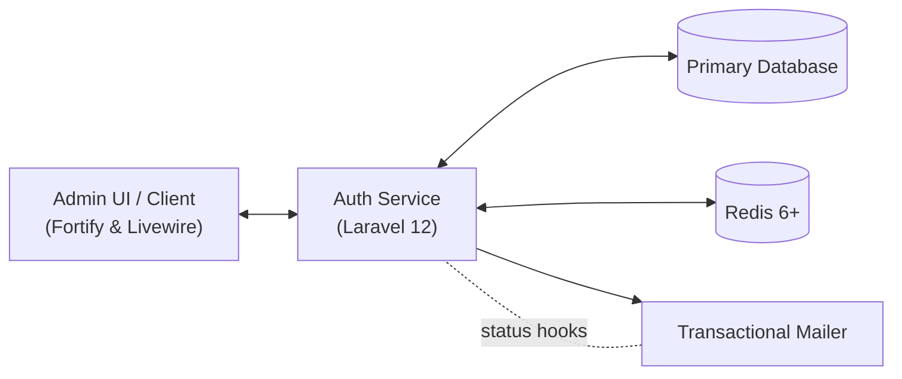

# Chapter 0 — Project Grounding & Audit

Last updated: 2025-10-26

This chapter captures the baseline understanding of the TravianT authentication platform ahead of deeper feature work. It focuses on scope confirmation, runtime targets, operational policies, and an up-to-date inventory of the moving parts inside the Laravel 12 codebase.

## Scope & Non-Goals

- **Primary scope:** Account authentication, sitter delegation, session management, administrator tooling for multi-account alerts, storefront order views, and the supporting audit/compliance features (trusted devices, impersonation logging, account deletion, data exports).
- **Out of scope (current cycle):** Core gameplay mechanics, alliance/forum rebuilds that still live under `/_travian`, payment gateway integrations, and bespoke profile customisation beyond Laravel Fortify defaults. Those initiatives are tracked in the migration and component plans under `docs/`.
- **Interfaces served:** Fortify-powered web authentication flows, Livewire administrative and player dashboards, and the RESTful sitter delegation API (`/api/v1/sitters`).

## Architecture Overview

- The Laravel application exposes Fortify endpoints and Livewire surfaces while orchestrating sitter delegation and audit logging.
- Redis backs sessions, cache, queues, and the sitter handshake flow; Horizon is **not** in play.
- The transactional mailer (SES-compatible) delivers verification and recovery traffic; alerting runs through the admin UI instead of email.

## Application Inventory

> All lists are sourced from the current codebase (`main`, 73f8ba2a). Generated with `php artisan route:list --json` (using an in-memory SQLite connection) and directory scans under `app/`.

### Routes

| Surface | Key endpoints | Notes |
| --- | --- | --- |
| Public landing | `GET /` | Redirect to Fortify login. |
| Storefront (web) | `storefront/*` views + invokable checkout/product controllers | Guarded by default `web` middleware only. |
| Authenticated player routes | Maintenance, ban, verification gates; orders; session management; impersonation revoke; `TwoFactorController` screen; village Livewire views | Wrapped in `auth:{guard}` with nested `verified`, `game.*`, `game.sitter` middleware set. |
| Admin console | `admin/*` dashboard, campaign customer segments resource & recalculation, multi-account alert workflows, staff session index | Protected by `auth.admin` + `log.staff.action` policies. |
| API v1 | `/api/v1/sitters` (`index`, `store`, `destroy`) | RESTful sitter delegation management behind `auth`, `verified`, throttle middleware. |
| Framework tooling | Fortify auth routes, Livewire uploads, Flux assets, Debugbar, Swagger documentation | Provided by vendor packages. |

### Controllers

- `App\Http\Controllers\Admin\{CampaignCustomerSegmentController, MultiAccountAlertController, UserSessionController}`
- `App\Http\Controllers\Api\V1\SitterDelegationController`
- `App\Http\Controllers\Auth\PasswordResetLinkController`
- `App\Http\Controllers\Auth\EmailVerificationNotificationController`
- `App\Http\Controllers\Frontend\OrderController`
- `App\Http\Controllers\ImpersonationController`
- `App\Http\Controllers\Security\TwoFactorController`
- `App\Http\Controllers\SessionManagementController`
- `App\Http\Controllers\Storefront\{CheckoutController, ProductController}`
- `App\Http\Controllers\Api\OpenApi` (Swagger bridge)

### Livewire Components

- Account & system: `Account\{BannedNotice, TrustedDevices, VerificationPrompt}`, `System\MaintenanceNotice`
- Dashboard & player: `Dashboard\Overview`, `Village\{Overview, Infrastructure, BuildingQueue}`
- Messaging & reports: `Messages\{Inbox, Compose}`, `Reports\{Inbox, BattleReport}`
- Alliance: `Alliance\{Profile, Members, Diplomacy, Forums, Topics, Posts}`
- Administration: `Admin\Dashboard`

### Models

Core authentication & commerce: `Activation`, `AccountDeletionRequest`, `AuthEvent`, `AuditLog`, `CampaignCustomerSegment`, `CoreCatalog`, `Customer`, `LegalDocument`, `LoginActivity`, `LoginIpLog`, `Order`, `Product`, `Setting`, `SitterAssignment`, `SitterDelegation`, `TrustedDevice`, `User`, `UserDataExport`, `UserSession`.

Game domain snapshot: `Alliance`, `AllianceForum`, `AllianceMember`, `AlliancePost`, `AllianceTopic`, `Game\{Adventure, AttackDispatch, Building, BuildingType, CapturedUnit, DailyQuestProgress, Enforcement, GameSummaryMetric, MapTile, Movement, MovementOrder, Oasis, Quest, QuestProgress, ReinforcementGarrison, ServerTask, Trapped, UnitTrainingBatch, Village, VillageBuildingUpgrade, VillageResource, VillageUnit, WorldCasualtySnapshot}`, `Message`, `MessageRecipient`, `Report`, `ReportRecipient`.

### Jobs

- Provisioning & ops: `Provisioning\{InstallGameWorldJob, RestartEngineJob, StartEngineJob, StopEngineJob, UninstallGameWorldJob}`, `FlushLoginTokensJob`, `VerifyDatabaseIntegrity`
- Player lifecycle: `BackupDatabase`, `CheckGameFinish`, `CleanupInactivePlayers`, `ExpireSitterDelegations`, `GenerateUserDataExport`, `PruneExpiredSessions`, `ScheduleDailyQuestReset`, `ScheduleMedalDistribution`
- Game loop processors: `Process{Adventures, AllianceBonus, Artifacts, AttackArrival, Auctions, BuildingCompletion, DailyQuests, FakeUsers, Medals, NatarVillages, ReinforcementArrival, ResearchCompletion, ReturnMovement, ServerTasks, TroopTraining}`
- Alerting: `RebuildMultiAccountAlerts`

### Events & Observers

- Events: `DelegationAssigned`, `DelegationUpdated`, `DelegationRevoked`, `Auth\{LoginFailed, LoginSucceeded, UserLoggedOut}`
- Observers: `ActivationObserver`, `SitterAssignmentObserver`, `SitterDelegationObserver`, `UserObserver`

### Console Commands

- Health & operations: `CheckApplicationHealth`, `EnforceIpRetentionCommand`, `FlushLoginTokensCommand`, `RotateSignedCookieKeysCommand`
- Game management: `GameEngineCommand`, `ProcessServerTasksCommand`, `ImportLegacyVillagesCommand`, `SecuredKeyGenerateCommand`, `CreateTestUser`

## Runtime & Tooling Targets

- **PHP:** Project requires `^8.2`; local environment currently uses PHP 8.3.25 (`php -v`). Align deployment targets with PHP 8.3.x for parity.
- **Composer:** v2.8.11.
- **Node.js:** v23.10.0 with npm 11.6.2. Tailwind v4 and Vite handle the front-end build as per `package.json`.
- **Laravel:** Framework `^12.0`, Fortify `^1.31`, Livewire `^3.5`, Flux UI `^2.5`, Pest `^3.8`, PHPUnit `^11.5.3`.

## API & UI Policy

- **Primary contract:** Fortify + Livewire web flows with session-based guards. REST endpoints are limited to sitter delegation; any new APIs should extend `/api/v1` with token or session auth and documented via Swagger (`/api/documentation`).
- **No public GraphQL or websocket surfaces.** Real-time updates rely on Livewire polling.
- **Admin tooling remains web-first.** Multihunter and staff tools must authenticate through administrator guards; do not expose equivalent JSON endpoints without approval.

## Coding Standards

- PSR-12 compliance enforced by Laravel Pint (`vendor/bin/pint --dirty`); no local rule overrides.
- PHP 8 features (constructor property promotion, strict types, explicit returns) are mandatory.
- Prefer Form Requests, policies, and Eloquent relationships; avoid direct `DB::` facade usage for new code.
- Front-end work should use Tailwind CSS v4 utilities and Flux UI components already included in the project.
- Pest is the default testing framework; feature tests should cover happy path and failure cases before merging.

## Trust & Security Files

- `LICENSE` → MIT; confirmed present at repository root.
- `SECURITY.md` → Coordinated disclosure process documented; ensure updates whenever on-call procedures change.
- `CODE_OF_CONDUCT.md` → Contributor covenant variant adopted.

## GitHub Metadata

Action item: update the repository description and topics in the GitHub settings to reflect “TravianT Authentication Platform · Laravel 12 · Fortify, Livewire, Redis”. Suggested topics: `laravel`, `authentication`, `travian`, `livewire`, `redis`, `fortify`.

## Environments & Release Channels

- **Local:** Sail, Docker, or native stack with MySQL/SQLite, Redis, Mailpit. Use feature branches and run targeted Pest suites + Pint prior to pushing.
- **Staging:** Mirrors production infrastructure using masked data sets, Redis queues, and sandbox email delivery. Release candidates deploy here for QA and regression validation.
- **Production:** HA Laravel deployment behind Nginx with Supervisor-managed workers. Release flow follows `main → staging → production` with semantic tags and pre-deployment database backups.
- **Hotfixes:** Branch from `production` tag, cherry-pick into `main` post-release, and document in `CHANGELOG.md`.

---

Questions or updates? Open an issue tagged `project-audit` to keep this chapter accurate.
